# Walmart Sales Data Analysis

## About the Project

This analytical project delves into a comprehensive Walmart sales dataset with the objective of extracting actionable insights that could steer strategic decision-making towards optimizing sales operations. By evaluating the performance of different branches, product lines, and consumer buying patterns, we aim to sharpen sales strategies for enhanced profitability. 

The data was sourced from the renowned Kaggle Walmart Sales Forecasting Competition https://www.kaggle.com/c/walmart-recruiting-store-sales-forecasting, which encompasses historical sales figures across various store departments and incorporates the impact of strategic markdown events.

## Dataset Overview

The dataset, a rich compilation of transactions from three distinct Walmart branches, was curated for the Kaggle Walmart Sales Forecasting Competition. With a granular breakdown across 17 attributes and spanning over 1000 records, the dataset is a potent resource for a multifaceted sales analysis.

## Data Schema

**Here's an overview of the dataset structure:**

| Column                     | Description                                  | Data Type         |
|----------------------------|----------------------------------------------|-------------------|
| `invoice_id`               | Unique invoice identifier                    | `VARCHAR(30)`     |
| `branch`                   | Branch identifier                            | `VARCHAR(5)`      |
| `city`                     | Branch location                              | `VARCHAR(30)`     |
| `customer_type`            | Categorization of customer                   | `VARCHAR(30)`     |
| `gender`                   | Gender of the customer                       | `VARCHAR(10)`     |
| `product_line`             | Category of the product sold                 | `VARCHAR(100)`    |
| `unit_price`               | Price per unit of the product                | `DECIMAL(10, 2)`  |
| `quantity`                 | Quantity of product sold                     | `INT`             |
| `VAT`                      | Tax value added to the COGS                  | `FLOAT(6, 4)`     |
| `total`                    | Total purchase cost                          | `DECIMAL(10, 2)`  |
| `date`                     | Date of the transaction                      | `DATE`            |
| `time`                     | Time of the transaction                      | `TIMESTAMP`       |
| `payment_method`           | Payment method utilized                      | `DECIMAL(10, 2)`  |
| `cogs`                     | Cost of goods sold                           | `DECIMAL(10, 2)`  |
| `gross_margin_percentage`  | Gross margin represented as a percentage     | `FLOAT(11, 9)`    |
| `gross_income`             | Gross income from the transaction            | `DECIMAL(10, 2)`  |
| `rating`                   | Customer satisfaction rating                 | `FLOAT(2, 1)`     |

## Project Goals

The core mission of this endeavor is to decode the underlying factors influencing the sales dynamics at different Walmart branches, with an intent to:

- Identify high-performing and underachieving product lines.
- Observe sales trends and patterns across various product categories.
- Understand customer demographics and purchase behavior.
- Evaluate and refine sales and marketing strategies for revenue maximization.

## Analytical Perspectives

The project is segmented into various analyses, each focusing on specific aspects:

- **Product Analysis**: Evaluates performance across different product lines and identifies areas for improvement.

- **Sales Analysis**: Gauges the trends in product sales, aiding in the assessment and refinement of sales strategies.

- **Customer Analysis**: Dissects customer segments to reveal purchase trends and segment profitability.

## Methodological Approach

- **Data Wrangling**: Initial data examination for anomalies like missing values and employing data replacement techniques as necessary.

- **Database Construction**: Implementation of SQL tables and integration of data.

- **Feature Engineering**: Derivation of new insightful attributes from existing data fields.

- **Exploratory Data Analysis (EDA)**: In-depth data probing to respond to the investigative queries listed.


# Product Analysis: 

Conducted analysis on the data to understand the different product lines, the products lines performing best and the product lines that need to be improved.

## Business Questions Answered:

1. How many unique product lines does the data have?
2. What is the most selling product line?
3. What is the total revenue by month?
4. What month had the largest COGS?
5. What product line had the largest revenue?
6. What is the city with the largest revenue?
7. What product line had the largest VAT?
8. Categorize each product line as "Good" or "Bad" based on its average sales     compared to the overall average sales of all product lines.
9. Which branch sold more products than average product sold?
10. What is the most common product line by gender?
11. What is the average rating of each product line?
12. What is the most common payment method?

```sql
-- 1.How many unique product lines does the data have?
SELECT
	DISTINCT product_line
FROM sales;

-- 2.What is the most selling product line?
SELECT
	SUM(quantity) as qty,
    product_line
FROM sales
GROUP BY product_line
ORDER BY qty DESC;

-- 3.What is the total revenue by month?
SELECT
	month_name AS month,
	SUM(total) AS total_revenue
FROM sales
GROUP BY month_name 
ORDER BY total_revenue;

-- 4.What month had the largest COGS?
SELECT
	month_name AS month,
	SUM(cogs) AS cogs
FROM sales
GROUP BY month_name 
ORDER BY cogs;

-- 5.What product line had the largest revenue?
SELECT
	product_line,
	SUM(total) as total_revenue
FROM sales
GROUP BY product_line
ORDER BY total_revenue DESC;

-- 6.What is the city with the largest revenue?
SELECT
	branch,
	city,
	SUM(total) AS total_revenue
FROM sales
GROUP BY city, branch 
ORDER BY total_revenue;

-- 7.What product line had the largest VAT?
SELECT
	product_line,
	AVG(tax_pct) as avg_tax
FROM sales
GROUP BY product_line
ORDER BY avg_tax DESC;

-- 8.Categorize each product line as "Good" or "Bad" based on its 
--average sales compared to the overall average sales of all product line

SELECT 
  product_line,
  CASE
    WHEN AVG(quantity) > (SELECT AVG(quantity) FROM sales) THEN 'Good'
    ELSE 'Bad'
  END AS remark
FROM sales
GROUP BY product_line;

-- 9.Which branch sold more products than average product sold?
SELECT 
	branch, 
    SUM(quantity) AS qnty
FROM sales
GROUP BY branch
HAVING SUM(quantity) > (SELECT AVG(quantity) FROM sales);

-- 10.What is the most common product line by gender?
SELECT
	gender,
    product_line,
    COUNT(gender) AS total_cnt
FROM sales
GROUP BY gender, product_line
ORDER BY total_cnt DESC;

-- 11.What is the average rating of each product line?
SELECT
	ROUND(AVG(rating), 2) as avg_rating,
    product_line
FROM sales
GROUP BY product_line
ORDER BY avg_rating DESC;

-- 12.What is the most common payment method?
SELECT Payment, COUNT(*) AS NumberOfTransactions
FROM sales
GROUP BY Payment
ORDER BY NumberOfTransactions DESC;
```
## Insights: 

**1.Product Variety:** Walmart's diverse range of product lines demonstrates its commitment to meeting diverse consumer needs, enhancing market penetration and customer contentment.

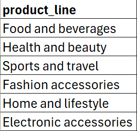


**2.Top Seller:** Electronic accessories emerge as Walmart's top-selling category, indicating a strong market preference and highlighting the importance of focused inventory management in this high-demand sector.

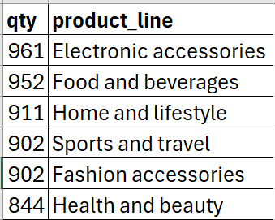


**3.Revenue Trends:** January leads in sales for Walmart, indicating a post-holiday surge in revenue, which could inform strategic stock and marketing plans for future years.

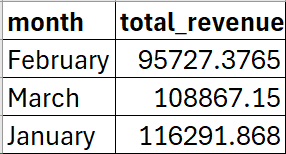


**4.Cost Analysis:** January's highest COGS suggests a potential inventory buildup in anticipation of holiday sales, highlighting opportunities for more efficient inventory management.

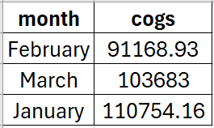


**5.Revenue Leaders:** Food and beverages lead Walmart's revenue, suggesting a high turnover sector that may benefit from focused promotional strategies and inventory optimization.

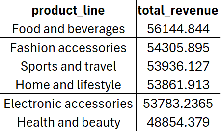


**6.City Performance:** Naypyitaw's branch leads in revenue, indicating a potential hotspot for Walmart's sales and a prime candidate for further investment and market analysis.

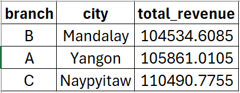


**7.Tax Insights:** Home and lifestyle products face the highest VAT rates, suggesting a need for Walmart to possibly reevaluate pricing strategies within this category to maintain customer appeal.

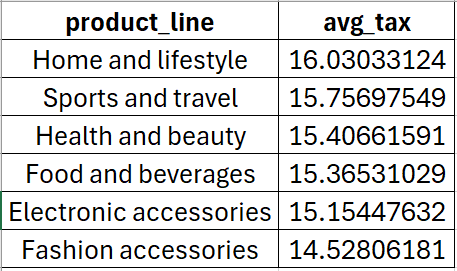


**8.Sales Performance:** Home and lifestyle, along with electronic accessories, stand out with 'Good' sales performance, while food and fashion accessories may require strategic enhancements to boost sales. 

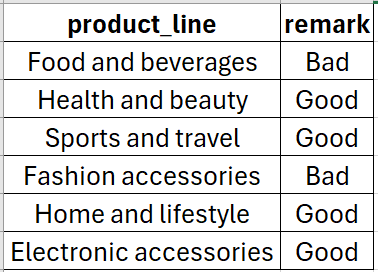


**9.Branch Analysis:** Branch A leads in quantity sold, suggesting successful sales strategies or a strong market presence.

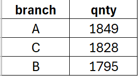


**10.Gender Preferences:** Fashion accessories are particularly popular among female shoppers, while health and beauty products are favored by males, highlighting gender-specific market trends for targeted advertising.

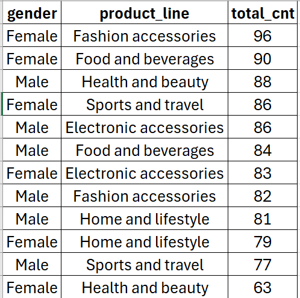


**11.Customer Satisfaction:** Average product line ratings are indicative of customer satisfaction and can inform quality improvements or highlight strengths.Food and beverages receive the highest customer ratings at Walmart, indicating strong satisfaction.

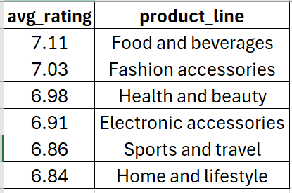


**12.Payment Methods:** The most common payment method can influence transaction processing improvements and customer experience initiatives. We can see that cash and eWallet are nearly tied as the preferred payment methods, signaling a potential shift in payment trends.

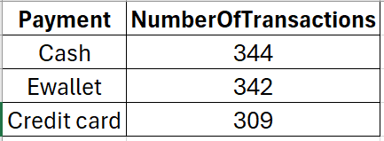


# Customer Analysis:

This analysis seeks to decipher the sales trends across various product categories, providing insights into the efficacy of current sales strategies. The findings will guide necessary adjustments to enhance sales performance and drive revenue growth.

## Business Questions Answered:

## Business Questions Answered:

1. What is the most common customer type?
2. Which customer type buys the most?
3. What is the gender of most of the customers?
4. What is the gender distribution per branch?
5. Which time of the day do customers give most ratings?
6. Which time of the day do customers give most ratings per branch?
7. Which day fo the week has the best avg ratings?
8. Which day of the week has the best average ratings per branch?

```sql
-- 1. Which are the most common customer types?

SELECT
  customer_type,
  COUNT(*) AS count
FROM sales
GROUP BY customer_type
ORDER BY count DESC;

-- 2. Which customer type buys the most?
SELECT
  customer_type,
  SUM(quantity) AS total_quantity
FROM sales
GROUP BY customer_type
ORDER BY total_quantity DESC
LIMIT 1;


-- 3. What is the gender of most of the customers?
SELECT
	gender,
	COUNT(*) as gender_cnt
FROM sales
GROUP BY gender
ORDER BY gender_cnt DESC;

-- 4. What is the gender distribution per branch?
SELECT
	gender,
	COUNT(*) as gender_cnt
FROM sales
WHERE branch = "C"
GROUP BY gender
ORDER BY gender_cnt DESC;

-- 5. Which time of the day do customers give most ratings?
SELECT
	time_of_day,
	AVG(rating) AS avg_rating
FROM sales
GROUP BY time_of_day
ORDER BY avg_rating DESC;

-- 6. Which time of the day do customers give most ratings per branch?
SELECT
	time_of_day,
	AVG(rating) AS avg_rating
FROM sales
WHERE branch = "A"
GROUP BY time_of_day
ORDER BY avg_rating DESC;

-- 7. Which day fo the week has the best avg ratings?
SELECT
	day_name,
	AVG(rating) AS avg_rating
FROM sales
GROUP BY day_name 
ORDER BY avg_rating DESC;

-- 8. Which day of the week has the best average ratings per branch?
SELECT 
	day_name,
	COUNT(day_name) total_sales
FROM sales
WHERE branch = "C"
GROUP BY day_name
ORDER BY total_sales DESC;
```


## Conclusions and Business Insights

Through meticulous analysis, the project addresses a suite of pertinent business queries, providing vital insights for strategic sales and marketing alignment.

## Revenue and Profit Calculations

The project incorporates a detailed financial computation framework, from calculating the COGS to deducing the Gross Margin percentage, a critical metric for evaluating sales profitability.

## Acknowledgements

The data utilized in this project is accredited to the Kaggle Walmart Sales Forecasting Competition. The insights generated here are intended to supplement Walmart's strategic sales initiatives and are a testament to the power of data in guiding business strategy.

---

For more insights and a complete overview of the analysis, visit the project repository [here](<insert your GitHub repository link>).

```

Feel free to replace `<insert your GitHub repository link>` with the actual URL to your repository. This README is designed to provide a comprehensive and professional introduction to your project, perfect for stakeholders looking to understand your work at a glance.
